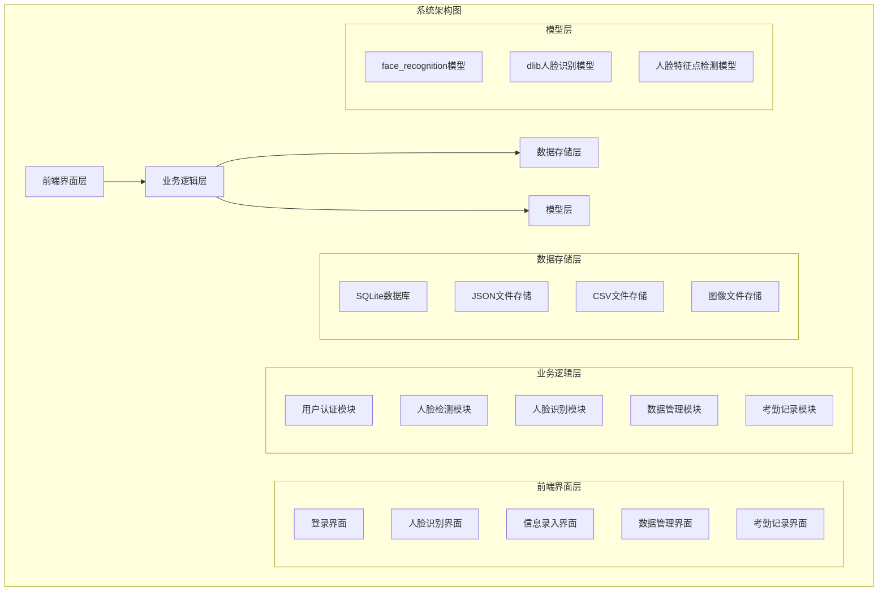
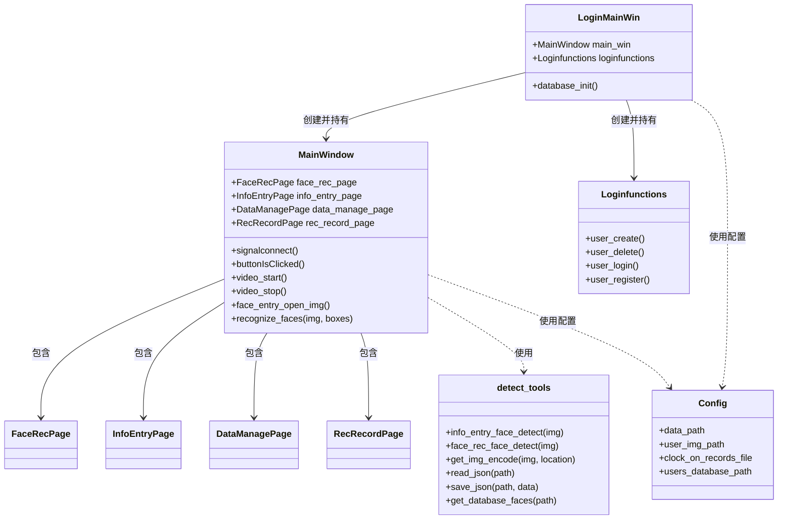
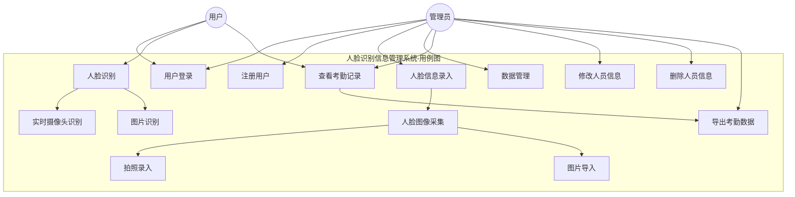
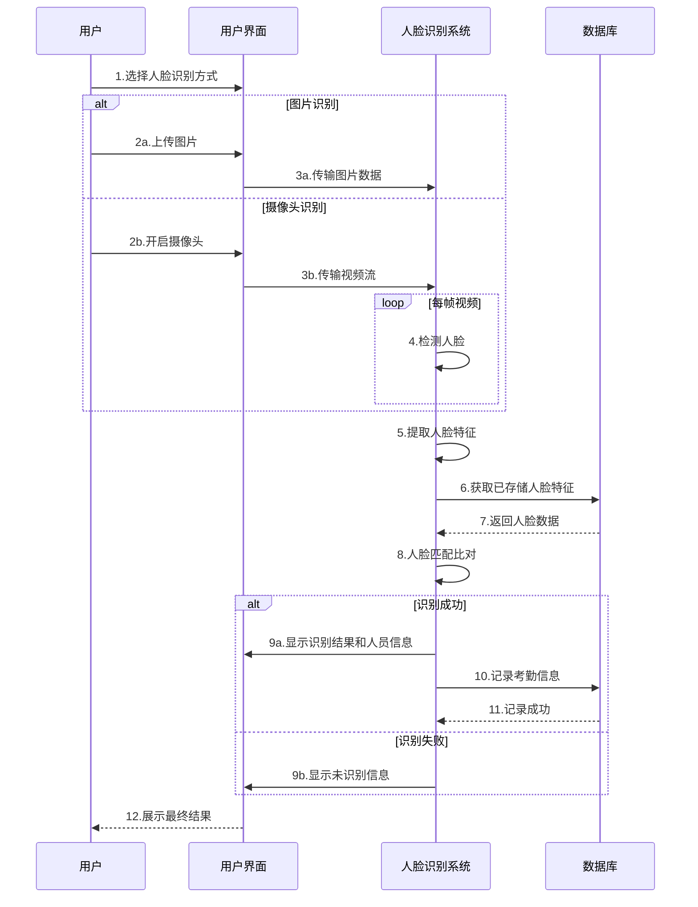
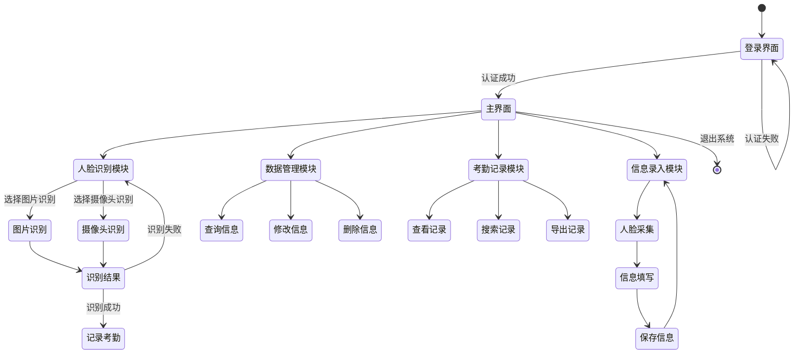

# Face Recognition Management System

<div align="center">


**一个基于深度学习的人脸识别信息管理系统，支持人脸录入、识别、考勤打卡等功能**

[English](#english) | [中文](#chinese)

</div>

---

## <a id="chinese"></a>🇨🇳 中文说明

### 📖 项目简介

Face Recognition Management System 是一个基于 PyQt5、OpenCV 和深度学习技术的智能人脸识别系统。该系统集成了人脸检测、识别、信息管理和考勤打卡功能，适用于企业、学校等需要人员管理的场所。系统采用模块化设计，通过多种UML图展示系统结构与功能，便于理解与二次开发。

### ✨ 主要功能

- **👤 用户认证系统**
  - 用户注册与登录
  - SQLite 数据库存储用户凭证

- **📝 人脸信息录入**
  - 支持摄像头实时拍照
  - 支持图片文件上传
  - 自动人脸检测和裁剪
  - 个人信息管理（姓名、ID、性别、年龄、公司）

- **🔍 人脸识别**
  - 实时摄像头识别
  - 图片文件识别
  - 多人脸同时识别
  - 高精度人脸匹配

- **⏰ 考勤打卡**
  - 自动记录识别时间
  - 考勤记录管理
  - 数据导出功能

- **📊 数据管理**
  - 人员信息增删改查
  - 考勤记录查询
  - 数据统计分析

### 🛠️ 技术栈

- **框架**: PyQt5 (GUI界面)
- **深度学习**: dlib + face_recognition
- **图像处理**: OpenCV (核心图像处理引擎) 🎯
- **数据库**: SQLite
- **数据处理**: pandas
- **编程语言**: Python 3.x

> **特别说明**: 本项目大量使用了 **OpenCV** 库进行图像预处理、人脸检测、图像格式转换等核心功能，OpenCV 是整个系统的图像处理基础。

### 📋 系统要求

- Python 3.7+
- Windows 10/11 (主要支持)
- 摄像头设备（可选）
- 至少 4GB RAM

### 🚀 安装指南

1. **克隆项目**
   ```bash
   git clone https://github.com/Dadalia1917/face-recognition-management-system.git
   cd face-recognition-management-system
   ```

2. **安装依赖**
   ```bash
   pip install -r requirements.txt
   ```

3. **下载模型文件**
   
   确保 `model/` 目录下包含以下文件：
   - `dlib_face_recognition_resnet_model_v1.dat`
   - `shape_predictor_68_face_landmarks.dat`

4. **运行程序**
   ```bash
   # 启动登录界面
   python login_main.py
   ```

### 📂 项目结构

```
face-recognition-management-system/
├── MainProgram.py              # 主程序文件
├── login_main.py              # 登录入口
├── login_functions.py         # 登录功能实现
├── detect_tools.py           # 人脸检测工具
├── Config.py                 # 配置文件
├── requirements.txt          # 依赖包列表
├── data/                     # 数据目录
│   ├── info.json            # 用户信息数据
│   ├── users.db             # 用户登录数据库
│   ├── user_imgs/           # 用户头像目录
│   └── clock_in_records.csv # 考勤记录
├── model/                    # AI模型文件
│   ├── dlib_face_recognition_resnet_model_v1.dat
│   └── shape_predictor_68_face_landmarks.dat
└── UIProgram/               # UI界面文件
    ├── FaceRec.py          # 人脸识别界面
    ├── InfoEntry.py        # 信息录入界面
    ├── DataManageWidget.py # 数据管理界面
    ├── recRecordWidget.py  # 记录管理界面
    └── ui_imgs/            # 界面资源文件
```

### 🔄 系统架构图

以下是本系统的整体架构图，展示了系统的各个层次和组件：



### 📊 类图

下面的类图展示了系统中的主要类及其关系：



### 👥 用例图

下面是系统的用例图，展示了系统支持的主要功能和用户角色：



### ⏱️ 时序图

以下时序图展示了人脸识别的执行流程：



### 🔄 状态图

下面的状态图展示了系统的状态转换流程：



### 🎯 使用指南

1. **首次使用**
   - 运行 `python login_main.py` 启动系统
   - 注册管理员账户
   - 登录进入主界面

2. **录入人员信息**
   - 点击"信息录入"标签
   - 选择照片或使用摄像头拍照
   - 填写个人信息并保存

3. **人脸识别**
   - 点击"人脸识别"标签
   - 选择图片或开启摄像头
   - 系统自动识别并显示结果

4. **数据管理**
   - 点击"数据管理"查看所有人员
   - 支持搜索、修改、删除操作

5. **考勤记录**
   - 点击"打卡记录"查看考勤数据
   - 支持按时间、人员筛选

### 🎨 OpenCV 核心功能

本项目大量依赖 **OpenCV** 库实现以下核心功能：

- **📷 摄像头视频流处理**: 实时捕获和显示视频流
- **🖼️ 图像格式转换**: BGR、RGB、灰度图转换，适配PyQt5显示
- **✂️ 图像裁剪和缩放**: 人脸区域提取和尺寸调整
- **📐 图像几何变换**: 人脸框绘制和标注
- **💾 图像文件操作**: 支持中文路径的图像读写
- **🔄 实时图像处理**: 视频流中的实时人脸检测和识别

### ⚙️ 配置说明

编辑 `Config.py` 文件可以修改以下设置：

```python
# 数据存储路径
data_path = 'data/info.json'
user_img_path = 'data/user_imgs'
clock_on_records_file = 'data/clock_in_records.csv'

# 界面设置
mainwin_bg_img = 'UIProgram/ui_imgs/bgs/bg1.jpg'

# 数据库设置
users_database_path = "data/users.db"
```

### 🔧 常见问题

**Q: 无法检测到人脸？**
A: 确保光线充足，人脸正对摄像头，检查摄像头权限设置。

**Q: 识别准确率低？**
A: 建议使用清晰、正面的照片进行录入，避免侧脸或模糊图片。

**Q: 程序启动报错？**
A: 检查 Python 版本和依赖包是否正确安装，确保模型文件完整。

### 🤝 贡献指南

1. Fork 本项目
2. 创建特性分支 (`git checkout -b feature/AmazingFeature`)
3. 提交更改 (`git commit -m 'Add some AmazingFeature'`)
4. 推送到分支 (`git push origin feature/AmazingFeature`)
5. 打开 Pull Request

### 📄 许可证

本项目采用 MIT 许可证 - 查看 [LICENSE](LICENSE) 文件了解详情。

### 🙏 致谢

- [dlib](http://dlib.net/) - 人脸检测和识别库
- [face_recognition](https://github.com/ageitgey/face_recognition) - 人脸识别库
- [PyQt5](https://www.riverbankcomputing.com/software/pyqt/) - GUI框架

---

## <a id="english"></a>🇬🇧 English

### 📖 Project Description

Face Recognition Management System is an intelligent face recognition system based on PyQt5, OpenCV and deep learning technology. The system integrates face detection, recognition, information management, and attendance tracking functions, suitable for enterprises, schools, and other places that require personnel management. The system adopts a modular design, with various UML diagrams illustrating the system structure and functionality for better understanding and secondary development.

### ✨ Key Features

- **👤 User Authentication System**
  - User registration and login
  - SQLite database for user credentials

- **📝 Face Information Entry**
  - Real-time camera capture
  - Image file upload support
  - Automatic face detection and cropping
  - Personal information management (name, ID, gender, age, company)

- **🔍 Face Recognition**
  - Real-time camera recognition
  - Image file recognition
  - Multi-face simultaneous recognition
  - High-precision face matching

- **⏰ Attendance Tracking**
  - Automatic time recording
  - Attendance record management
  - Data export functionality

- **📊 Data Management**
  - Personnel information CRUD operations
  - Attendance record queries
  - Data statistics and analysis

### 🛠️ Tech Stack

- **Framework**: PyQt5 (GUI)
- **Deep Learning**: dlib + face_recognition
- **Image Processing**: OpenCV (Core Image Processing Engine) 🎯
- **Database**: SQLite
- **Data Processing**: pandas
- **Programming Language**: Python 3.x

> **Important Note**: This project extensively uses **OpenCV** library for image preprocessing, face detection, image format conversion and other core functionalities. OpenCV serves as the fundamental image processing foundation of the entire system.

### 📋 System Requirements

- Python 3.7+
- Windows 10/11 (primary support)
- Camera device (optional)
- At least 4GB RAM

### 🚀 Installation Guide

1. **Clone the project**
   ```bash
   git clone https://github.com/your-username/face-recognition-management-system.git
   cd face-recognition-management-system
   ```

2. **Install dependencies**
   ```bash
   pip install -r requirements.txt
   ```

3. **Download model files**
   
   Ensure the following files are in the `model/` directory:
   - `dlib_face_recognition_resnet_model_v1.dat`
   - `shape_predictor_68_face_landmarks.dat`

4. **Run the program**
   ```bash
   # Start the login interface
   python login_main.py
   ```

### 🎯 Usage Guide

1. **First Use**
   - Run `python login_main.py` to start the system
   - Register an administrator account
   - Login to enter the main interface

2. **Personnel Information Entry**
   - Click the "Information Entry" tab
   - Select a photo or use camera to take a picture
   - Fill in personal information and save

3. **Face Recognition**
   - Click the "Face Recognition" tab
   - Select an image or turn on the camera
   - The system automatically recognizes and displays results

4. **Data Management**
   - Click "Data Management" to view all personnel
   - Support search, modify, and delete operations

5. **Attendance Records**
   - Click "Attendance Records" to view attendance data
   - Support filtering by time and personnel

### 🎨 OpenCV Core Features

This project heavily relies on **OpenCV** library to implement the following core functionalities:

- **📷 Camera Video Stream Processing**: Real-time video capture and display
- **🖼️ Image Format Conversion**: BGR, RGB, grayscale conversion for PyQt5 compatibility
- **✂️ Image Cropping and Scaling**: Face region extraction and size adjustment
- **📐 Image Geometric Transformation**: Face bounding box drawing and annotation
- **💾 Image File Operations**: Image read/write with Chinese path support
- **🔄 Real-time Image Processing**: Real-time face detection and recognition in video streams

### 🤝 Contributing

1. Fork the project
2. Create a feature branch (`git checkout -b feature/AmazingFeature`)
3. Commit your changes (`git commit -m 'Add some AmazingFeature'`)
4. Push to the branch (`git push origin feature/AmazingFeature`)
5. Open a Pull Request

### 📄 License

This project is licensed under the MIT License - see the [LICENSE](LICENSE) file for details.

### 🙏 Acknowledgments

- [dlib](http://dlib.net/) - Face detection and recognition library
- [face_recognition](https://github.com/ageitgey/face_recognition) - Face recognition library
- [PyQt5](https://www.riverbankcomputing.com/software/pyqt/) - GUI framework

---

<div align="center">
  <p>Made with ❤️ by developers who care about intelligent systems</p>
</div>
